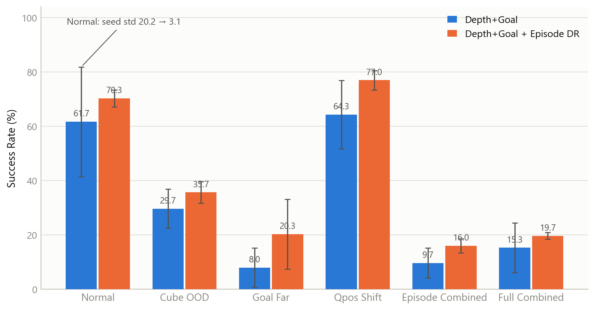
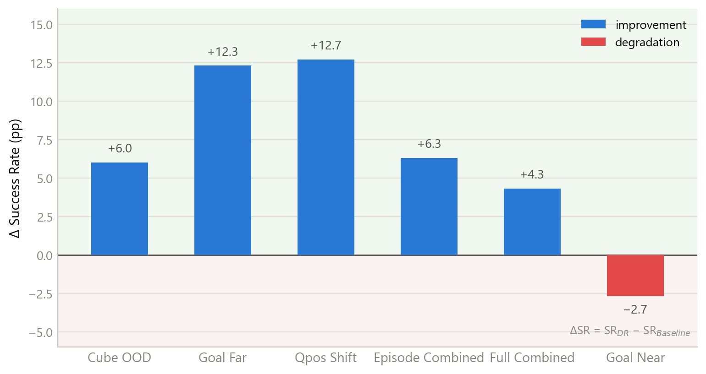
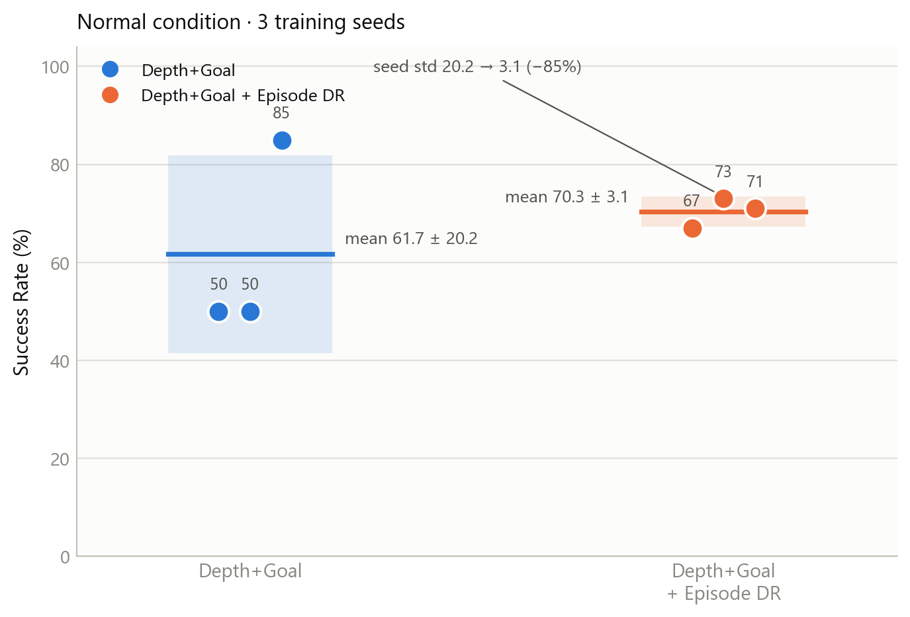
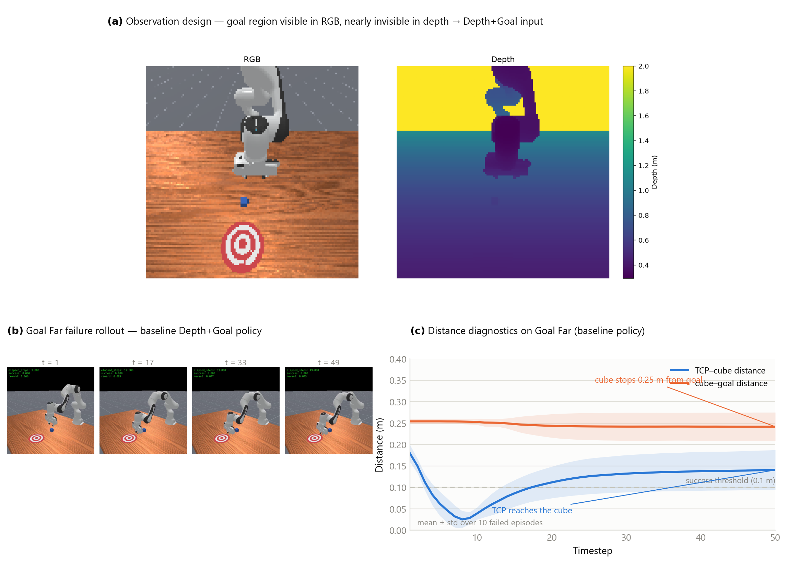

# Robust Visual Manipulation under Distribution Shift

A ManiSkill-based framework for studying **OOD generalization and robustness of visual robot manipulation policies** under environment distribution shifts.

This project investigates how **observation design** and **domain randomization** affect PPO policies for robotic pushing when object positions, goal distances, robot initial states, and physical parameters differ from the training distribution.

---

## Overview

### Research Question

> How well do visual robot manipulation policies generalize beyond their training distribution, and can domain randomization improve their robustness?

We build a GPU-parallel training and OOD evaluation framework based on **ManiSkill + PPO**, including:

- Up to **2048 parallel simulation environments**
- State / Depth / Depth + Goal observation settings
- Modular Observation–Encoder architecture
- Episode-level Domain Randomization
- Multiple OOD evaluation conditions
- Multi-seed evaluation
- Rollout and trajectory-based failure analysis

---

## Observation Design

We compare three observation settings:

| Policy | Observation |
|---|---|
| State | Privileged environment state |
| Depth | Depth image + robot proprioception |
| Depth + Goal | Depth image + task goal + robot proprioception |

For the PushCube task, the planar target region is not distinguishable from the tabletop in the depth image.

Therefore, the final visual policy uses:

**Depth + Task Goal + Proprioception**

where:

- **Depth** provides scene geometry and cube information
- **Task Goal** provides the desired target position
- **Proprioception** includes robot joint states and TCP pose

The cube position is **not directly provided** to the visual policy and must still be inferred from visual observation.

---

## Method

### PPO Training

The policy is trained with PPO in GPU-parallel ManiSkill environments.

Main setup:

- Simulator: `physx_cuda`
- Parallel environments: `2048`
- Observation: `depth`
- Encoder: `depth_goal`
- Total training steps: `2M`
- Training seeds: `1 / 2 / 3`

### Episode-level Domain Randomization

Episode DR randomizes three factors during training:

| Factor | Randomization |
|---|---|
| Cube position | Expanded XY initialization range |
| Goal distance | Randomized pushing distance |
| Robot initial state | Increased joint-state initialization noise |

The network architecture, PPO hyperparameters, observation design, and depth preprocessing are kept fixed between the baseline and DR experiments.

---

## OOD Benchmark

Policies are evaluated under multiple held-out distribution shifts.

### Episode-level OOD

- `Cube OOD` — unseen object initialization region
- `Goal Near` — shorter pushing distance
- `Goal Far` — longer pushing distance
- `Qpos Shift` — increased robot joint-state perturbation
- `Episode Combined` — simultaneous cube, goal, and robot-state shifts

### Physics OOD

- Cube mass shift
- Contact friction shift
- Combined physics shift

### Full OOD

- `Full Combined` — simultaneous episode-level and physics distribution shifts

The primary evaluation metric is:

**Success Rate at Episode End**

Each policy is evaluated using **100 episodes per condition**.

---

## Results

We compare the **Depth + Goal baseline** with **Depth + Goal + Episode DR** across three independently trained seeds.

### Main Results

| Condition | Depth + Goal | + Episode DR |
|---|---:|---:|
| Normal | 61.7 ± 20.2% | **70.3 ± 3.1%** |
| Cube OOD | 29.7 ± 7.2% | **35.7 ± 4.0%** |
| Goal Near | **93.7 ± 0.6%** | 91.0 ± 1.7% |
| Goal Far | 8.0 ± 7.2% | **20.3 ± 12.9%** |
| Qpos Shift | 64.3 ± 12.6% | **77.0 ± 3.6%** |
| Episode Combined | 9.7 ± 5.5% | **16.0 ± 2.6%** |
| Full Combined | 15.3 ± 9.1% | **19.7 ± 1.2%** |

Values are **mean ± standard deviation over three training seeds**.

Each trained policy is evaluated on 100 episodes per condition using the same evaluation seed.

<p align="center">
  
</p>

### OOD Improvement

<p align="center">
  
</p>

Episode DR improves most OOD conditions — up to **+12.7 pp** on `Qpos Shift` and **+12.3 pp** on `Goal Far` — while slightly degrading `Goal Near` (−2.7 pp), showing that the effect is not uniform across distribution shifts.

### Training-seed Stability

<p align="center">
  
</p>

On the Normal condition, Episode DR reduces seed-level variance from **±20.2 pp** to **±3.1 pp**, substantially improving training stability.

### Key Findings

Episode-level Domain Randomization improves both average performance and training stability in several conditions.

Notable observations include:

- Normal success improves from **61.7% to 70.3%**
- Goal-distance OOD improves from **8.0% to 20.3%**
- Qpos-shift success improves from **64.3% to 77.0%**
- Training-seed variance is substantially reduced under several conditions
- `Cube OOD`, `Goal Far`, and combined distribution shifts remain challenging

Physics shifts cause relatively limited degradation compared with episode-level distribution shifts, suggesting that the current task is more sensitive to **spatial and initial-state shifts** than to the tested mass/friction changes.

---

## Failure Analysis

To understand policy failures beyond aggregate success rates, we analyze rollout videos together with privileged diagnostic trajectories.

The privileged information is used **only for analysis**, not as policy input.

We track:

- TCP-to-cube distance
- Cube-to-goal distance
- TCP-to-goal distance
- Cube and TCP trajectories

<p align="center">
  
</p>

### Observed Failure Modes

Failure cases suggest that OOD errors are not purely caused by object localization.

In many failed rollouts, the policy can approach the cube but fails to:

- maintain stable contact,
- select an effective pushing direction,
- sustain pushing for sufficiently long trajectories,
- recover when multiple distribution shifts occur simultaneously.

`Goal Far` remains particularly challenging, indicating limited generalization to long-horizon pushing behavior.

---

## Project Structure

```text
maniskill-robust-manipulation/
│
├── configs/              # Training configurations
│
├── src/
│   ├── envs/             # ManiSkill environments and OOD variants
│   ├── models/           # Observation encoders and PPO agent
│   ├── train.py          # PPO training
│   └── evaluate.py       # Unified OOD evaluation
│
├── tests/                # Environment / observation smoke tests
├── experiments/          # Experiment and analysis scripts
├── plot_figures.py       # Generates all figures in results/figures/
│
├── results/
│   ├── figures/          # Main visualization results
│   └── *.csv             # Evaluation results
│
├── videos/               # Rollout videos + diagnostic trajectories (distances.csv)
├── docs/                 # Experiment notes and benchmark design
│
├── requirements.txt
└── README.md
```

---

## Installation

Create a Python environment and install the required dependencies.

```bash
pip install -r requirements.txt
```

Core dependencies include:

- ManiSkill
- PyTorch
- Gymnasium
- NumPy
- Pandas
- PyYAML
- Matplotlib
- TensorBoard

A CUDA-enabled GPU is recommended for large-scale parallel training.

---

## Training

Example: train the Depth + Goal + Episode DR policy.

```bash
python -m src.train \
   --config configs/depth_goal_dr_gpu.yaml
```

Example configuration:

```yaml
env_id: PushCubeDepthGoalDR-v1

obs_mode: depth
encoder_type: depth_goal

sim_backend: physx_cuda
cuda: true

num_envs: 2048
num_steps: 20
total_timesteps: 2000000
```

Training checkpoints are saved under:

```text
runs/<experiment_name>/
```

Large checkpoints and TensorBoard logs are not included in the repository.

---

## Evaluation

Example: evaluate one trained Depth + Goal + Episode DR policy on all OOD conditions.

```bash
python -m src.evaluate \
   --checkpoint runs/depth_goal_dr_gpu_seed1/final_ckpt.pt \
   --model-name depth_goal_dr_seed1 \
   --case all \
   --num-episodes 100 \
   --seed 1000 \
   --sim-backend physx_cuda \
   --device cuda \
   --obs-mode depth \
   --encoder-type depth_goal \
   --output results/depth_goal_dr_seed1_all.csv
```

For multi-seed experiments, all trained policies are evaluated using the same evaluation settings.

---

## Figures

All figures in `results/figures/` are generated by one script:

```bash
python plot_figures.py
```

| Figure | Description |
|---|---|
| `ood_success_comparison.png` | Main grouped bar chart (mean ± std over 3 seeds) |
| `ood_improvement.png` | ΔSR = SR_DR − SR_Baseline per OOD condition |
| `seed_stability.png` | Seed-level dot plot on the Normal condition |
| `failure_analysis.png` | Observation design, failure rollout, distance diagnostics |

---

## Current Progress

### Completed

- [x] GPU-parallel PPO training pipeline
- [x] Unified OOD evaluation framework
- [x] State / Depth / Depth + Goal observation framework
- [x] Episode-level Domain Randomization
- [x] Episode / Physics / Full OOD benchmark
- [x] Three-seed baseline evaluation
- [x] Three-seed Episode DR evaluation
- [x] Rollout-based failure analysis
- [x] TCP–cube–goal trajectory diagnostics
- [x] Publication-quality result figures

### Ongoing

- [ ] Factor-wise ablation of Cube / Goal / Qpos randomization
- [ ] Analysis of combined OOD failure modes
- [ ] Improved robustness under long-distance pushing
- [ ] Additional visual manipulation tasks

---

## Notes

This repository focuses on understanding **visual robot manipulation robustness under distribution shift**, rather than maximizing performance on a single PushCube benchmark.

The current experiments aim to separate the effects of:

1. observation design,
2. visual partial observability,
3. training distribution coverage,
4. domain randomization,
5. policy failure under OOD conditions.
